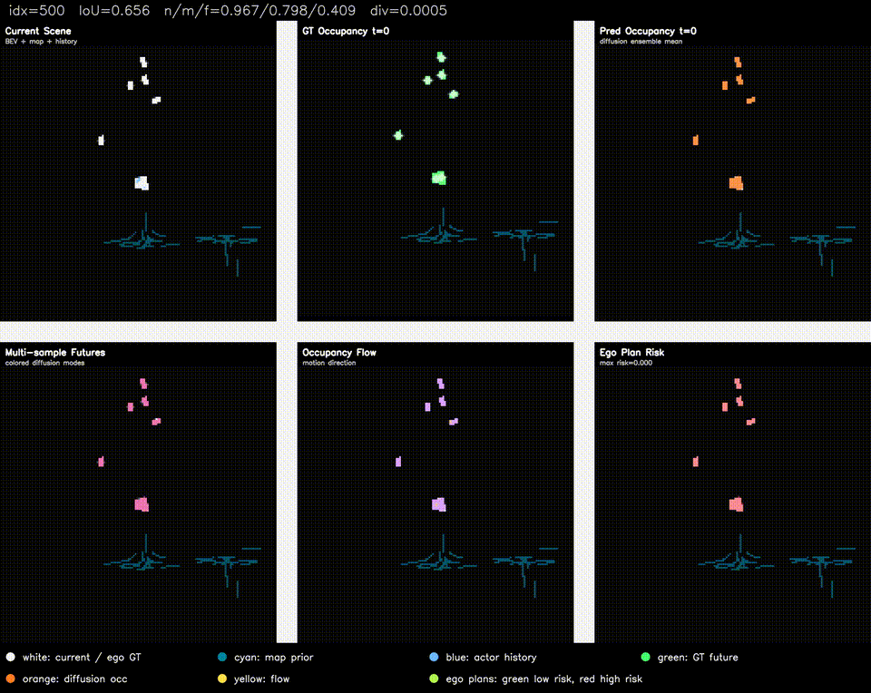

# DriveWorld

BEV occupancy diffusion world model for autonomous-driving scene forecasting and planning-on-prediction demos.

DriveWorld predicts future BEV occupancy and occupancy flow from historical BEV scenes, map priors, traffic-light states, and agent features. The demo searches lane-following ego candidates on the predicted world and scores collision, uncertainty, off-road, smoothness, and progress costs.

## Demo

[](assets/demo_500.mp4)

Click the preview to open the MP4 rollout.

## Highlights

- Conditional DDIM diffusion model for future BEV occupancy generation.
- Map-enhanced conditioning with lane, drivable-area, road-edge, distance-transform, and history-motion hints.
- Temporal BEV encoder for historical occupancy dynamics.
- Cross-attention fusion for agent features, map vectors, traffic lights, and optional camera/LiDAR tokens.
- Multi-sample diffusion inference for uncertainty visualization.
- Lane-graph risk planner for planning-on-prediction demos.
- YAML-driven training, evaluation, sampling, and demo generation.

## Method

DriveWorld follows a world-prediction-then-planning design:

```text
history BEV + agent states + map raster/vector + traffic lights
        |
        v
conditional BEV diffusion denoiser
  - temporal BEV encoder for history motion
  - vector-map / traffic-light / agent token encoders
  - cross-attention fusion during denoising
        |
        v
future occupancy + occupancy flow + multi-sample uncertainty
        |
        v
lane-graph risk planner
  - generate lane-following ego candidates
  - score collision / uncertainty / off-road / smoothness / progress
```

The ego plan is not used as a diffusion-model input. Instead, the model first predicts future scene evolution, and the planner searches for a low-risk route inside the predicted world.

## Documentation

- [Data preparation](docs/DATA.md)
- [Model design](docs/MODEL.md)
- [Demo visualization](docs/DEMO.md)
- [Results and limitations](docs/RESULTS.md)

## Project Layout

```text
DriveWorld/
  configs/
    train.yaml
    eval.yaml
    sample.yaml
    demo.yaml
    prepare.yaml
  docs/
    DATA.md
    MODEL.md
    DEMO.md
    RESULTS.md
  scripts/
    model.py                    # diffusion denoiser, DDIM scheduler helpers, loss, sampling
    train.py                    # distributed training entry
    eval.py                     # IoU evaluation entry
    sample.py                   # PNG sampling entry
    _demo.py                    # multi-panel PNG/MP4 demo and lane-graph risk planner
    womd.py                     # WOMD BEV dataset and preprocessing utilities
    prepare_womd_scenarios.py   # WOMD -> BEV shard preprocessing
    sensor_encoders.py          # optional camera/LiDAR token encoder
    check_env.py                # environment sanity check
  assets/
    demo_500.gif                # README preview
    demo_500.mp4                # README rollout video
  data/
    raw/womd/                   # optional raw WOMD data for preprocessing
    womd/                       # processed WOMD BEV shards
  outputs/
    model_param.pt              # best checkpoint, previously epoch_016.pt
    demo/
    sample/
```

## Quick Start

```bash
cd DriveWorld
```

### Environment Setup

Create a Python environment and install dependencies:

```bash
conda create -n driveworld python=3.10
conda activate driveworld
pip install -r requirements.txt
```

For CUDA training, install the PyTorch build that matches your CUDA version from the official PyTorch instructions before installing the remaining packages.

Check environment:

```bash
python scripts/check_env.py
```

### Checkpoint

The trained checkpoint is not committed to Git because model files are large. Put the released or locally trained checkpoint at:

```text
outputs/model_param.pt
```

This file is the default checkpoint used by `configs/eval.yaml`, `configs/sample.yaml`, and `configs/demo.yaml`. In this project cleanup, `model_param.pt` corresponds to the previous best checkpoint `epoch_016.pt`.

## Data Preparation

DriveWorld uses the Waymo Open Motion Dataset (WOMD). Download the Motion Dataset scenario TFRecord files from the official [Waymo Open Dataset download page](https://waymo.com/open/download), then place them under `data/raw/womd` with split folders:

```text
data/raw/womd/
  training/
    *.tfrecord*
  validation/
    *.tfrecord*
  testing/
    *.tfrecord*        # optional
```

Convert raw WOMD scenarios into BEV shard files:

```bash
python scripts/prepare_womd_scenarios.py --config configs/prepare.yaml
```

`configs/prepare.yaml` writes processed data to `data/womd` by default. The training and validation commands expect this structure:

```text
data/womd/
  training_00000.pt
  training_00001.pt
  training_metadata.json
  validation_00000.pt
  validation_metadata.json
```

To process a specific split, override the YAML value:

```bash
python scripts/prepare_womd_scenarios.py --config configs/prepare.yaml --split validation
```

For a quick smoke test, limit the number of source TFRecord files:

```bash
python scripts/prepare_womd_scenarios.py --config configs/prepare.yaml --split training --max_files 2
```

## Train And Evaluate

Train:

```bash
torchrun --standalone --nproc_per_node=8 scripts/train.py --config configs/train.yaml
```

Resume training:

```bash
torchrun --standalone --nproc_per_node=8 scripts/train.py --config configs/train.yaml --resume outputs/last.pt
```

Evaluate:

```bash
python scripts/eval.py --config configs/eval.yaml
```

Generate sample PNGs:

```bash
python scripts/sample.py --config configs/sample.yaml
```

Generate enterprise demo PNG/MP4 files:

```bash
python scripts/_demo.py --config configs/demo.yaml
```

The demo writes:

```text
outputs/demo/demo_<index>.png
outputs/demo/demo_<index>.mp4
outputs/demo/demo_<index>.json
```

The six-panel demo contains current BEV context, GT future occupancy, predicted future occupancy, multi-sample future modes, occupancy flow, and lane-following ego risk planning.

Any YAML value can be overridden from the command line:

```bash
python scripts/_demo.py --config configs/demo.yaml --indices 10,50,100 --scale 5
```

## Configs

Each entry point has one matching YAML file:

```text
configs/prepare.yaml -> scripts/prepare_womd_scenarios.py
configs/train.yaml   -> scripts/train.py
configs/eval.yaml    -> scripts/eval.py
configs/sample.yaml  -> scripts/sample.py
configs/demo.yaml    -> scripts/_demo.py
```

The YAML keys directly match command-line argument names.

## Data And Checkpoint

Default paths are project-relative:

```text
data/raw/womd          # raw WOMD files, optional for preprocessing
data/womd              # processed BEV shards
outputs/model_param.pt # best checkpoint
outputs/sample         # generated sample PNGs
outputs/demo           # generated demo PNG/MP4 files
```

Large files such as datasets, checkpoints, PNGs, and MP4s are ignored by Git. Put them under `data/` and `outputs/` locally, or provide external release links.

## Notes And Limitations

- This repository focuses on a BEV occupancy generative world-model prototype, not a complete autonomous-driving stack.
- The released preprocessing path uses WOMD scenario TFRecords and track/map-derived BEV occupancy.
- Camera/LiDAR sensor conditioning is exposed through `sensor_encoders.py`, but the default WOMD pipeline does not require raw sensor tensors.
- The checkpoint, processed data, generated PNGs, and generated MP4s should be stored outside Git or attached as release artifacts.

## Metrics

The latest model version reached approximately:

```text
occ_iou      0.6169
near_iou     0.8670
mid_iou      0.6403
far_iou      0.4772
pred_pos     0.00487
true_pos     0.00498
```

These numbers are intended as project-level validation for the cleaned prototype, not as an official benchmark against SOTA systems.

## Resume Bullet

Designed and implemented a BEV occupancy diffusion world model for autonomous-driving scene forecasting. Built a DDIM conditional diffusion denoiser with temporal BEV attention, cross-attention fusion for map vectors, traffic lights and agent features, map-enhanced conditioning, multi-sample uncertainty visualization, and a lane-graph risk planner that selects low-risk ego trajectories from predicted future occupancy.

## Citation

If this repository is useful for your work, please cite the related datasets and libraries used by the project, especially the Waymo Open Motion Dataset and Hugging Face Diffusers.

## Acknowledgements

This project builds on open-source tools including PyTorch, Hugging Face Diffusers, Waymo Open Dataset tools, NumPy, OpenCV, Matplotlib, and Shapely.

